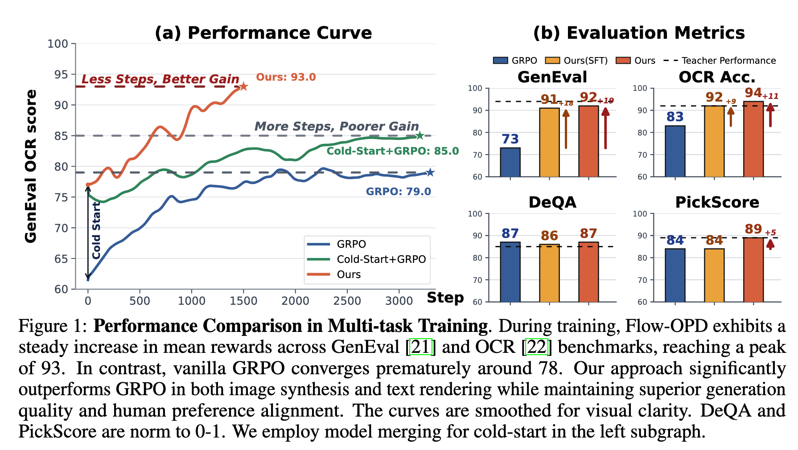
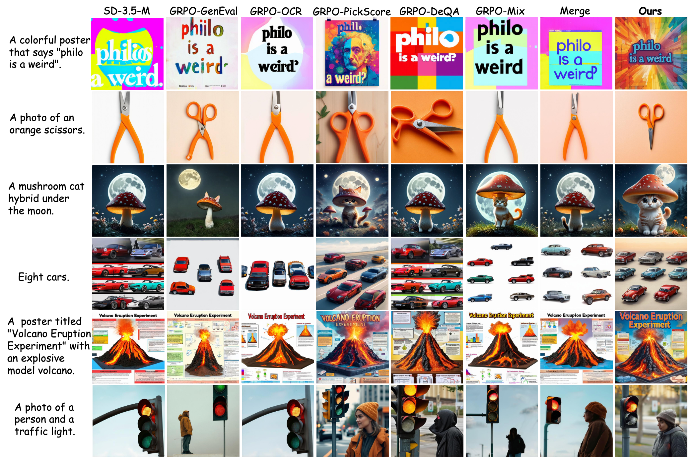
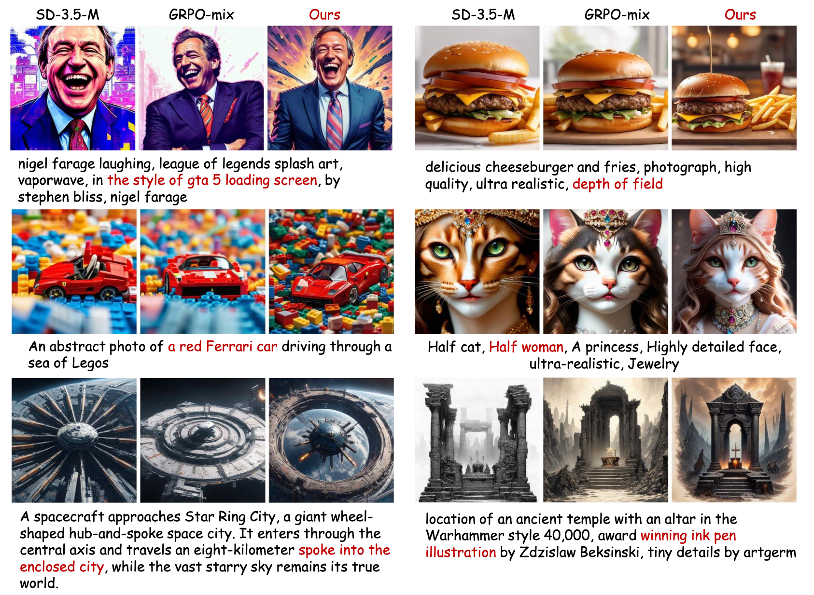
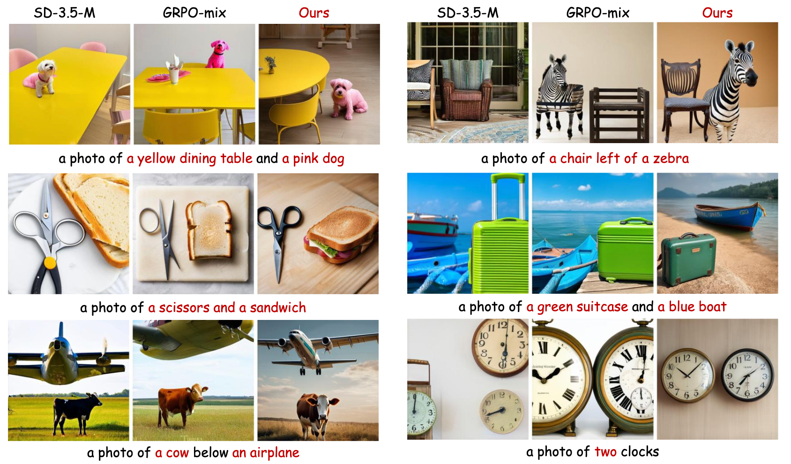
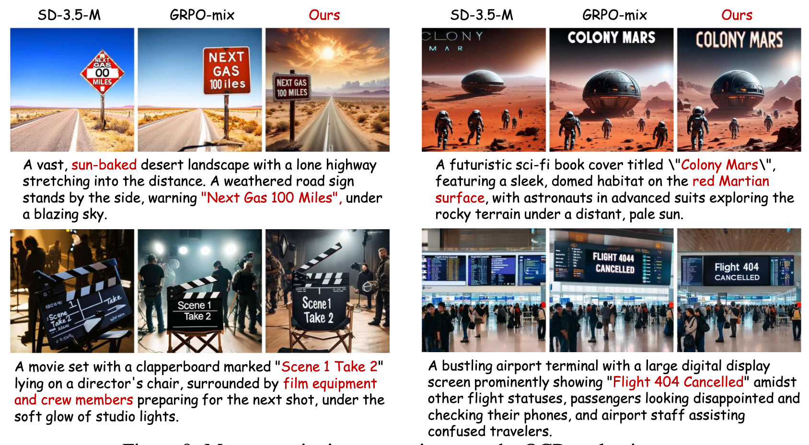

# Flow-OPD: On-Policy Distillation for Flow Matching Models


<div align="center">

[](https://costaliya.github.io/Flow-OPD/)
[](https://arxiv.org/abs/2605.08063)
[](https://github.com/CostaliyA/Flow-OPD)
[](https://huggingface.co/CostaliyA/Flow-OPD)

> **Flow-OPD** integrates On-Policy Distillation into the Flow Matching pipeline, replacing sparse scalar rewards with dense, trajectory-level, multi-teacher vector field supervision. Evaluated on SD-3.5-Medium, Flow-OPD achieves **+18pt average improvement** over vanilla GRPO and surpasses individual teacher models on OCR and DeQA.

</div>

---

## 🎯 Key Results

| Model | GenEval | OCR Acc. | DeQA | PickScore | Average |
|---|---|---|---|---|---|
| SD-3.5-M (base) | 0.63 | 0.59 | 4.07 | 21.64 | 0.72 |
| GRPO-Mix (best baseline) | 0.73 | 0.83 | 4.33 | 21.84 | 0.82 |
| **Flow-OPD (Merge Init)** | **0.92** | **0.94** | **4.35** | **23.08** | **0.90** |

- ✨ **+18pt** average improvement over base model
- 🚀 **+8pt** improvement over GRPO-Mix (best baseline)
- 📊 **0.92** GenEval score (base: 0.63)
- 📝 **0.94** OCR accuracy (base: 0.59)

---

## 🔬 Method Overview

Flow-OPD decouples expertise acquisition from model unification through a two-stage process:

1. **🧊 Cold Start Initialization** — SFT or Model Merging to initialize the student model
2. **👨‍🏫 Multi-Teacher On-Policy Distillation** — Dense vector field supervision from multiple teachers

The key innovations include:

- **⚡ On-Policy Sampling (SDE)**: Stochastic exploration via SDE for diverse trajectory sampling
- **🔀 Multi-Teacher Dense Labeling**: Each teacher (GenEval, OCR, DeQA, PickScore) acts as a Generative Reward Model returning a full vector field
- **🎨 MAR (Manifold Anchor Regularization)**: KL regularization from a frozen aesthetic teacher prevents aesthetic degradation

---

## 📋 Todo List

### 🔄 In Progress

- [ ] Release full training code

### ✅ Completed

- [x] Release model weights ([HuggingFace](https://huggingface.co/CostaliyA/Flow-OPD))
- [x] Release paper ([arXiv](https://github.com/CostaliyA/Flow-OPD/blob/main/flow-opd.pdf))

---

## 🎨 Qualitative Results

### Overview



### Comparison



### More Results (1/3)



### More Results (2/3)



### More Results (3/3)



---

## 📚 Citation

```bibtex
@misc{fang2026flowopdonpolicydistillationflow,
      title={Flow-OPD: On-Policy Distillation for Flow Matching Models},
      author={Zhen Fang and Wenxuan Huang and Yu Zeng and Yiming Zhao and Shuang Chen and Kaituo Feng and Yunlong Lin and Lin Chen and Zehui Chen and Shaosheng Cao and Feng Zhao},
      year={2026},
      eprint={2605.08063},
      archivePrefix={arXiv},
      primaryClass={cs.CV},
      url={https://arxiv.org/abs/2605.08063},
}
```

---

## 🙏 Acknowledgements

This repo is based on [flow-grpo](https://github.com/yifan123/flow_grpo). We thank the authors for their valuable contributions to the AIGC community.
